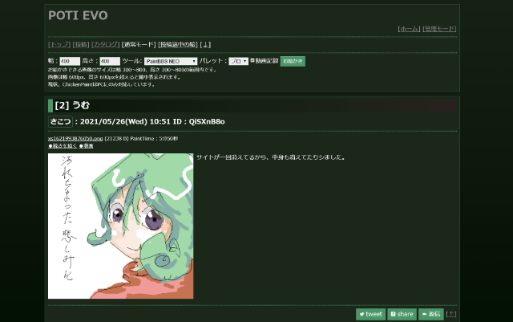

# POTI-board EVO 用テーマ

[POTI-board EVO](https://github.com/satopian/poti-kaini) のテーマ開発用リポジトリです。

## MONO_DEV

改二のデフォルトだった「MONO」をちょっといじったやつです。



- EVO (POTI-board v3.00以降)対応。つまり、ChickenPaint対応。
- 複数パレット対応。
- cssで色の切り替えが可能。

## MONO DEV 5

MONO_DEVをPOTI5に対応させたようなものです。

## テーマ変更の仕方（POTI5の場合）

- まず、potiboardがきちんと動いていることを確認します。念のため`config.php`のバックアップを取っておいてください。

1. [releases](https://github.com/sakots/poti-EVO-themes/releases)のページから、ダウンロードします。
2. 解凍したあと、フォルダごと`templates`フォルダ内にコピーします。
3. `config.php`で`SKIN_DIR`の値を変更します。MONO DEV 5の場合は、monodev_5/です。

   ``` php:config.php
   define('SKIN_DIR', 'monodev_5/');

   //define('SKIN_DIR', 'basic/');
   ```

4. `config.php`と`monodev_5`フォルダをアップロードします。
5. 管理画面から「更新」で、OK！

## ライセンスについて

わかりにくいと思うので説明。

以下を守っていただければ、自由に改造、再配布していただいて大丈夫です、というかしてください。

- わたし(`sakots`または`さこつ`)の著作権表記を消さないこと。
- Githubのこのページへのリンクを貼ること。
- 一緒にダウンロードできる`LISENCE`ファイるには一切手を加えないこと。（このライセンスの定義ですので）

また、こんな改造しました！と教えていただければむしろ嬉しいのでどんどんやってください。

---

## 更新履歴

### [2022/03/30] MONO_DEV v5.0.0

- 作成

### [2021/12/22] MONO_DEV v2.9.1

- 「続きを描く」画面での軽微なエラーを修正
  - 詳しくは[こちら](https://github.com/sakots/poti-EVO-themes/issues/16)

### [2021/12/06] MONO_DEV v2.9.0

- windows inkや、Apple Pencil使用時の
  - ChickenPaintのパレットを長押しした時にコンテキストメニュー(名前を付けて保存ほか)が開く問題に対応
  - PaintBBS NEOで、コピーやレイヤー結合を行う時に画面が上下に動く問題に対応しました。

### [2021/11/06] MONO_DEV v2.8.3

- POTI webサイトのURL変更
- サイズ違反の画像は最初からエラーにする
  - >大きなサイズの画像から続きを描く時に、NEOはキャンバスサイズで画像が切れる形でサイズの範囲内に収まります。しかし、ChickenPaintはChickenPaintが画像の幅と高さを計算しなおしてキャンバスサイズを決定します。つまりChickenPaintで続きを描く時に、サイズ違反の画像を読み込む事になり、save.phpで画像の幅と高さのサイズ違反を検出してエラーにするようになると、画像は開く事ができて続きを描く事はできのに投稿できないという問題が発生します。そのため時間をかけて描いたのに投稿できなくする形ではなく最初からエラーにするようになりました。新規エラーメッセージMSG047の処理を追加しました。またMSG047のエラーメッセージをtemplate_ini.phpに追加しました。
  - (by さとぴあ)

### [2021/10/19] MONO_DEV v2.8.2

- 2重送信防止のJavaScriptのバグを修正
- ブラウザバックの時には無効化されたボタンを有効化
  - (by さとぴあ)

### [2021/08/27] MONO_DEV v2.8.1

- MS045 エラーメッセージの変更 (by さとぴあ)
  - ChickenPaintの｢chi｣ファイルのアップロードも可能になったため、エラーメッセージを修正。
  - ｢chi｣ファイルはアニメファイルではありませんが、これまでは｢アニメファイルをアップロードしてください｣というエラーメッセージが出ていました。
- cssとscssのフォルダを分けた

### [2021/08/15] MONO_DEV v2.8.0

- 絵を描くのに集中できるよう、NEOのキャンバス周りの彩度を下げた
- scssの文法が汚かったので修正

### [2021/08/14] MONO_DEV v2.7.1

- Tweetの文字化けを回避するためのTweet用の変数追加(by さとぴあ)

### [2021/08/06] MONO_DEV v2.7.0

- `fix.js`の記述ミス修正
- iPadのSafari等でキャッシュを読み込ませないよう修正。

### [2021/08/04] MONO_DEV v2.6.0

- ChikenPaintにおいて、iPadでダブルタップズームが発生して、描画続行が困難になる問題を解消
- 各画像に`loading="lazy"`を追加（多少の読み込み効率の向上が見込まれます）

### [2021/07/18] MONO_DEV v2.5.0

- POTI v3.05.0対応

### [2021/06/23] MONO_DEV v2.4.1

- NEOでアプレットフィットONのときにキャンバスサイズを拡大して、そのままOFFにすると表示が崩れるの修正

### [2021/06/23] MONO_DEV v2.4.0

- css変更javascriptの革新(by さとぴあ)
- アプレットフィット機能を搭載。

### [2021/06/20] MONO_DEV v2.3.0

- ChickenPaintでペイント画面が選択される問題に対処、その他(by さとぴあ)
- css切り替えで背景がうまく変わらない問題に対処

### [2021/06/13] MONO_DEV v2.2.2

- NEOとしぃペインターの時は、Windows inkや2本指のジェスチャーによるブラウザバックを無効にする。(by さとぴあ)
  - 逆に言えば、chikenpaintでは2本指操作が使えるわけですな。

### [2021/06/08] MONO_DEV v2.2.1

- 細かな修正(by さとぴあ)
  - NEOの作者表記をfunigeに。
  - 現在は変更済みのバグに対する対処を削除。
  - しぃペインターとChickenPaintを使用しない設定の時にJava版のPaintBBSが起動していたのを修正。

### [2021/06/04] MONO_DEV v2.2.0

- POTI-board EVO v3.01.9対応。
  - 管理画面を2000件単位でページできるようになった。
  - v2.1.2のしぃペインターが起動できない問題を解決。

### [2021/06/04] MONO_DEV v2.1.2

- しぃペインターが起動できない問題に暫定対処。

### [2021/05/29]

- リリース用にパッケージを作った。
- readmeにテーマ変更の仕方追記。

### [2021/05/29] MONO_DEV v2.1.1

- 数字のみ入力できるテキストボックスのスピンボタンを消した。
- script整理。
- 著作権表記のところ微修正。

### [2021/05/26] MONO_DEV v2.1.0

- 色の変更をプルダウンメニューにした。

### [2021/05/26]

- リポジトリ生やした。
- monodev 2.0.0
